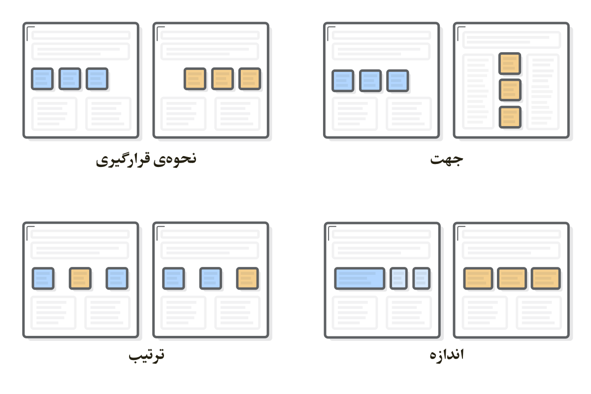
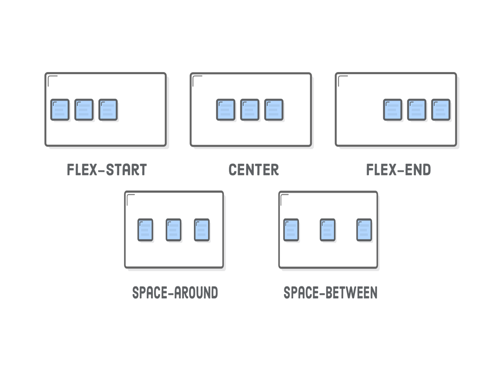
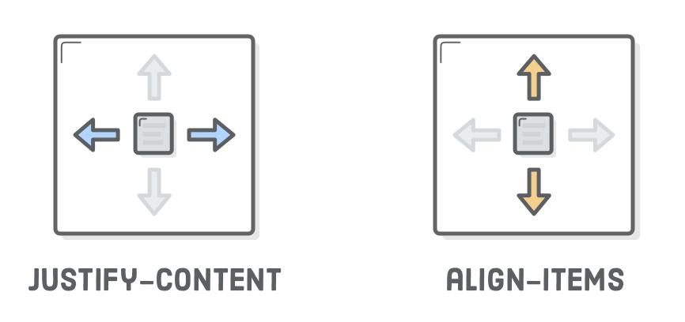

## مقدمه

Flexible Box یا همان Flexbox به عنوان جایگزینی برای Floats برای تعریف و پیادەسازی ظاهر کلی صفحات وب معرفی شد. البته باید این را در نظر داشت که Float فقط توانایی جابجایی افقی جعبەها را به ما میدهد اما Flexbox کنترل کاملی را برروی سایز، جهت، نحوەی قرارگیری و ترتیب جعبه ها به ما میدهد.

در ابتدا هدفی که Float در پی پیادەسازی آن بود، ایجاد قابلیتی برای جابجایی عکس در متن و ایجاد قالبی همچون مجله بود و به همین دلیل برای پیاده سازی ظاهر صفحەی سایت محدودیتهای زیادی را به کاربر تحمیل میکند و برای هرکاری تقریبا نیاز به دانستن ترفندی خاص برای رسیدن به ظاهر دلخواه است.
البته باید به این نکته دقت کرد که مرورگرهای قدیمیتر از Flexbox پشتیبانی نمیکنند و Float هنوز
برای چیدن جعبەها در کنار هم برای آن مرورگرها و همچنین برای قرارگیری عکس در میان متن در مرورگرهای امروزی استفاده میشود. برای مثال IE از نسخه ١١ از به طور محدود از این قابلیت پشتیبانی میکند.

## چگونه از Flex استفاده کنیم

Flexbox ابزارهای بسیار زیادی را برای چینش جعبەها و ساختن ظاهرکلی یک صفحه وب در اختیار ما قرار میدهد و در مقایسه با Float در یک نگاه متوجه این خواهید شد که برای ایجاد یک چینش و ساخت یک صفحەی وب Flexbox راەحلی بسیار تمیزتر، آسانتر و واضحتر خواهد بود، حال در این قسمت به توضیح مختصری از این ویژگیها و همچنین نحوەی پیادەسازی آنها میپردازیم.
برای شروعکافی استکه نگەدارندەای تعریفکنید و در فایل css مرتبط با آن مقدار display این نگەدارنده را برابر با flex قرار دهید تا محتویات داخل آن از این به بعد Flexbox شوند.
از این به بعد دربارەی هرکدام از ویژگیهاییکه میتواند به نگەدارنده و یا به شی داخل آن منتسب شود جداگانه پرداخت میشود.

For more details see [GitHub Flavored Markdown](https://guides.github.com/features/mastering-markdown/).

### ویژگیهای نگەدارنده :

* #### : justify-content
	*  center
	*  flex-start 
	*  flex-end
	*  space-around
	*  space-between

این ویژگی میتواند مقادیر بالا را اختیار کند. در شکل ٢ نحوەی قرارگیری محتوایات داخل Flexbox با توجه به اتخاذ هر یک از مقادیر بالا آمده است.

* #### : align-items
	*  center
	*  flex-start (top) 
	*  flex-end (bottom)
	*  stretch
	*  baseline

align-items مقادیر آورده شده در بالا را قبول میکند و در شکل ٣ تغییرات محتوای داخل Flexbox با توجه به مقادیر فوق را مشاهده میکنید.

به طور کلی دو ویژگی بالا اولی تغییرات افقی و دومی تغییرات عمودی محتویات داخل Flexbox را برعهده دارند.

از دیگر مزایای این قابلیت میتوان به بستەبندی خودکار اشاره کرد که این توانایی را به صفحەی وب شما میدهدکه محتوا را با توجه به اندازه صفحه ردیفبندی شده، نمایش دهد. در زیر به توضیح مقادیریکه توسط این ویژگیگرفته میشود میپردازیم. برای درک بهتر شکل ۵ را ببینید.

* #### : flex wrap
	*  wrap
	*  no-wrap

* #### : flex-direction
	*  row
	*  column
	*  row-reverse
	*  column-reverse
	
برای توضیح این ویژگی به علت سادگی و واضح بودن به شکل ۶ و ٧ اکتفا میکنیم.

البته باید در نظر داشت که همانند شکل ٨ justify-content و align-items در این دو جهت تغییر خواهد کرد.

حال به ویژگیهای محتوای داخل یک نگەدارنده از جنس Flexbox میپردازیم.

### ویژگیهای محتوای داخل یک Flexbox:

* #### : order
این ویژگی این امکان را میدهد تا هر عضوی از محتوا را دارای ترتیب مشخصی کند که بتواند
قبل یا بعد یک شی مشخص که اردر متفاوتی دارد قرار بگیرید. به عنوان ورودی این ویژگی عدد میگیرد.

* #### : align-self 
میتوان تمام ویژگیهای align-items کاملا و بەطور اختصاصی برای یک شی از
محتوا اجراکرد. 

* #### : flex
این قابلیت به اشیای محتوا این اجازه را میدهد که عرضی مرتجع و انعطافپذیر داشته باشند.
این قابلیت توانایی گرفتن مقادیری از جنس عدد یا عبارت initial را دارد. initial عرض ثابتی را به هر  شی اختصاص میدهد ولی اعداد این مفهوم را میرسانند که هرکدام از اشیای درون نگەدارنده چه مقدار عرض از عرضکل و به چه نسبتی اخذکنند.

* ####

## نتیجه‌گیری

برای جمعبندی میتوانگفتکهکارهاییکه با استفاده از این قابلیت میتوان انجام داد شاید با ابزارهای دیگر که از قبل در اختیار توسعه دهندگان بود توانایی انجام داشته باشند ولی این قابلیت کدهای مارا بسیار کوتاەتر، تمیزتر و قابلفهمتر میکند اما در اصل طراحی تغییری ایجاد نمیکند و تنها دغدغەهای شما را در طراحیکم میکند.
	

